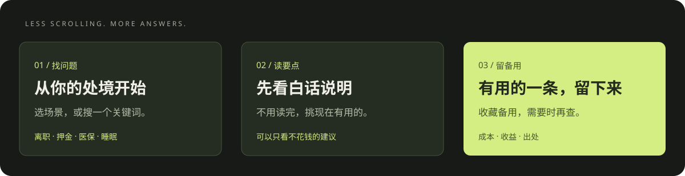
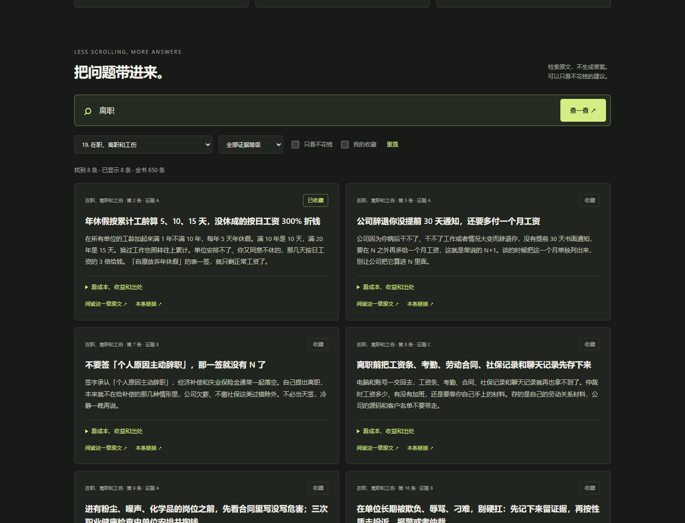
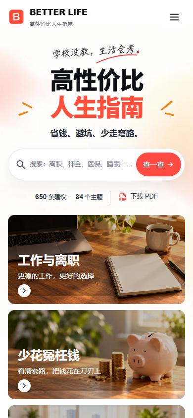

# 高性价比人生指南 · Better Life

**学校没教，生活会考。省钱、避坑、少走弯路，先从这里查起。**

650 条生活建议，34 个主题。每条都写清：要花什么、能换回什么、出处在哪里。

### [🧭 打开人生工具箱](https://fangx-ai.github.io/better-life/) · [📥 下载 PDF](https://github.com/eternity4719/HowToLiveBetter/releases/download/epub-latest/HowToLiveBetter.pdf)

免费查阅 · 不用注册 · 手机可用 · 可以收藏

---

## 先找与你有关的事

不必从第一页读到最后。**你现在卡在哪，就从哪开始。**

| 你的处境 | 从这里开始 |
| --- | --- |
| 💼 被裁了，准备离职，或者遇到工伤 | [工作与离职](https://fangx-ai.github.io/better-life/?chapter=19#library) |
| 💰 想省钱，怕被骗，不知道哪些钱不该花 | [少花冤枉钱](https://fangx-ai.github.io/better-life/?chapter=5#library) |
| 🏠 要租房，签合同，或者押金被扣了 | [租房与买房](https://fangx-ai.github.io/better-life/?chapter=15#library) |
| 👵 父母慢慢老了，想提前做些准备 | [家里有老人](https://fangx-ai.github.io/better-life/?chapter=17#library) |
| 👶 准备生孩子，不知道手续怎么安排 | [怀孕和生产](https://fangx-ai.github.io/better-life/?chapter=27#library) |
| 💻 接技术外包，想知道哪些单不能接 | [技术人的红线](https://fangx-ai.github.io/better-life/?chapter=11#library) |
| 🛟 没工作，手头没钱，想找帮助 | [没钱时怎么活](https://fangx-ai.github.io/better-life/?chapter=7#library) |
| 🌙 精力不够，时间总是不够用 | [时间与精力](https://fangx-ai.github.io/better-life/?chapter=3#library) |

**不知道属于哪一类？** [直接输入关键词](https://fangx-ai.github.io/better-life/#library)，比如「离职」「医保」「押金」「睡眠」。

## 用起来，只有三步

1. **找问题**：选一个场景，或者搜索关键词。
2. **读要点**：先看每条最显眼的白话说明；也可以筛选「不花钱」。
3. **留作备用**：收藏有用的条目，需要时再展开成本、收益和出处。

不用把所有建议都做到。**用上一条，就算数。**

## 打开后，你会看到什么？

不是把整本书丢给你。先选自己的处境，再找具体条目。

每条保留白话说明、成本、收益、来源和适用条件。想深入看，可以回到完整原文。

📱 看看手机上的样子

## 选你习惯的阅读方式

| 你想怎么用 | 点这里 |
| --- | --- |
| 手机上随手查，不想安装任何东西 | [在线工具箱](https://fangx-ai.github.io/better-life/) |
| 放在手机里，慢慢读或打印 | [PDF 完整版](https://github.com/eternity4719/HowToLiveBetter/releases/download/epub-latest/HowToLiveBetter.pdf) |
| 在 Kindle 或其他阅读器上读 | [EPUB 电子书](https://github.com/eternity4719/HowToLiveBetter/releases/download/epub-latest/HowToLiveBetter.epub) |
| 没有网络也想检索 | [离线单文件 HTML](https://github.com/eternity4719/HowToLiveBetter/releases/download/epub-latest/HowToLiveBetter.html) |
| 平时已经在用 Claude Code / Codex | [原项目 AI Skill 的安装说明](library/skills/life-decision-guide/README.md) |
| 直接读完整文字，或者自己整理 | [34 个章节的 Markdown 正文](library/book/) |
| 在 Obsidian 中用双链与节点图阅读 | [下载 Vault ZIP](public/downloads/better-life-obsidian.zip) · [打开方法](docs/OBSIDIAN.md) |

PDF、EPUB、离线 HTML 的下载来自原作者的发布页，可能比本项目的内容快照更新。

## 接下来，还会更顺手

- [x] 按生活场景进入指南
- [x] 关键词全文检索，按生活主题、不花钱和收藏筛选
- [x] 浏览器本地收藏，单条分享链接
- [x] PDF / EPUB / 离线版本入口
- [ ] **在线问答**：直接提问，回答附对应条目和出处
- [x] **Obsidian 知识库**：下载后直接打开，带目录、双链与分色关系图
- [x] **一页场景清单**：租房、离职、反冲动购物三份已制作，尚未公开部署或推广发布

Obsidian Vault 已生成，可下载仓库中的 ZIP。DeepSeek 问答已在本地完成真实接口验证，公网问答仍需独立 HTTPS 服务端。[反馈使用问题 →](https://github.com/Fangx-AI/better-life/issues/new/choose)

### 把建议，变成自己的生活指南

本地第一版已支持：把回答收进自己的目录、按主题整理、编辑正文、手动记录行动、查看与恢复历史版本、导出到 Obsidian；后来有新问题，可以结合当前指南和自己确认的情况继续问，新稿确认后才保存。

这部分使用真实服务端数据库，不是只放在当前浏览器的聊天记录。**私人指南与 Pricing 尚未在公网开放；真实邮箱登录和付款也未开通。**详见[个人指南说明](docs/PERSONAL-GUIDE.md)与[本机体验／后端接通说明](docs/MEMBERSHIP-SERVICE.md)。完整原书、检索与下载继续免费。

## 值得收藏，也值得发给有需要的人

这不是一份要求你变得更自律的任务表。它更像抽屉里的说明书：平时放着，遇到事拿出来翻。

**觉得好用，可以留一颗 Star。** 也可以把对应场景发给朋友，而不是让对方读完整本。

## 内容从哪里来？

内容来自 **[eternity4719 的《高性价比人生指南》](https://github.com/eternity4719/HowToLiveBetter)**。感谢原作者整理正文、证据与原始出处。

Better Life 是在原书基础上制作的使用入口：新增场景导航、检索界面、收藏和分享，**原书内容快照未改写，也不是原项目的官方版本**。页面隐藏编辑分级字样，保留实际限制与适用条件；完整文字可通过「章节原文」核对。

当前内容快照：**2026-10-03**，上游提交 [`fcc93eb`](https://github.com/eternity4719/HowToLiveBetter/commit/fcc93eb9a4bdc26e8a4e4c94bdaae0a89265927b)。不自动跟随上游更新。

收藏留在当前浏览器，不会上传，也不会自动跨设备同步。先看建议是否适合自己的情况；具体条件和出处都可查看原文。

正文：[CC BY 4.0](LICENSE-CONTENT) · 代码：[MIT](LICENSE)

---

[反馈问题](https://github.com/Fangx-AI/better-life/issues/new/choose) · [内容来源与版本](docs/SOURCES.md) · [开发说明](docs/DEVELOPMENT.md)
