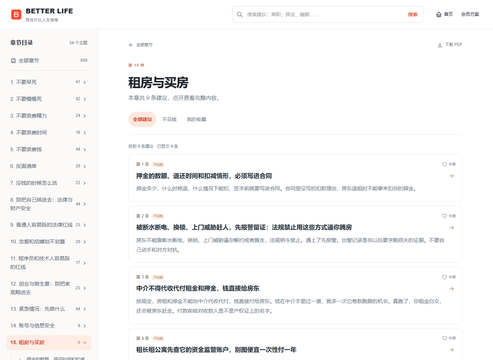

# 高性价比人生指南 · Better Life

**省钱、避坑、少走弯路。遇到事，先翻这本。**

650 条生活建议 · 34 个主题 · 完整阅读免费

**[打开人生工具箱 →](https://fangx-ai.github.io/better-life/)**

[按章节阅读](https://fangx-ai.github.io/better-life/?view=library) · [下载 PDF](https://github.com/eternity4719/HowToLiveBetter/releases/download/epub-latest/HowToLiveBetter.pdf) · [下载 Obsidian 知识库](https://fangx-ai.github.io/better-life/downloads/better-life-obsidian.zip)

不用注册 · 手机可用 · 可以收藏

## 不是让你更卷，是让你少踩坑

房东不退押金，离职前要留什么，哪些钱根本不值得花……

这里把生活里的具体问题，连到书中的实用建议。**不用读完一本书，先找到与你有关的那一条。**

首页找场景，地图看关联；具体条目单独阅读，不再挤在首页。

## 你现在遇到了什么？

| 正在遇到的事 | 从这里开始 |
| --- | --- |
| 准备离职、被裁了，或者遇到工伤 | [工作与离职 →](https://fangx-ai.github.io/better-life/?view=library&chapter=19) |
| 想省钱，怕被套路，不知道哪些钱不该花 | [少花冤枉钱 →](https://fangx-ai.github.io/better-life/?view=library&chapter=5) |
| 租房、签合同、押金被扣 | [租房与买房 →](https://fangx-ai.github.io/better-life/?view=library&chapter=15) |
| 父母慢慢老了，想提前准备 | [家里有老人 →](https://fangx-ai.github.io/better-life/?view=library&chapter=17) |
| 准备生孩子，手续不知道怎么安排 | [怀孕和生产 →](https://fangx-ai.github.io/better-life/?view=library&chapter=27) |
| 没工作、手头没钱，想找帮助 | [没钱时怎么活 →](https://fangx-ai.github.io/better-life/?view=library&chapter=7) |
| 精力不够，时间总是不够用 | [时间与精力 →](https://fangx-ai.github.io/better-life/?view=library&chapter=3) |
| 接技术外包，不确定哪些单能接 | [技术人的红线 →](https://fangx-ai.github.io/better-life/?view=library&chapter=11) |

**不知道属于哪一类？** [去搜索关键词](https://fangx-ai.github.io/better-life/?view=library)：离职、医保、押金、睡眠。

## 目录在左边，答案在眼前

**选章节 → 搜关键词 → 收藏有用的条目。**

每条可以展开看做法、成本、收益、适用条件和原始出处。还可以只看「不花钱」，或者回到自己的收藏。

看看手机上的样子

手机也能展开章节目录、检索和收藏。不需要安装 App。

## 带走，用你习惯的方式读

| 你想怎么用 | 入口 |
| --- | --- |
| 随手查，不安装东西 | [在线阅读与检索](https://fangx-ai.github.io/better-life/?view=library) |
| 存进手机、慢慢读或打印 | [PDF 完整版](https://github.com/eternity4719/HowToLiveBetter/releases/download/epub-latest/HowToLiveBetter.pdf) |
| 放进 Kindle 或其他阅读器 | [EPUB 电子书](https://github.com/eternity4719/HowToLiveBetter/releases/download/epub-latest/HowToLiveBetter.epub) |
| 没有网络也想检索 | [离线单文件 HTML](https://github.com/eternity4719/HowToLiveBetter/releases/download/epub-latest/HowToLiveBetter.html) |
| 在 Obsidian 里做笔记、看关系图 | [下载 Vault ZIP](https://fangx-ai.github.io/better-life/downloads/better-life-obsidian.zip) · [打开方法](docs/OBSIDIAN.md) |
| 直接读完整文字、自己整理 | [34 章 Markdown 正文](library/book/) |

Obsidian 版带章节目录、条目双链、来源笔记和分色关系图。下载 ZIP、解压，在 Obsidian 中「打开文件夹作为仓库」即可。

PDF、EPUB、离线 HTML 来自原作者发布页，可能比本站的内容快照更新。

## 发给朋友，不必让他读完整本

三份一页清单，按需要保存、打印或转发：

**[租房押金](https://fangx-ai.github.io/better-life/share-kit/rent-deposit.html)** · **[离职准备](https://fangx-ai.github.io/better-life/share-kit/leaving-job.html)** · **[下单前停一下](https://fangx-ai.github.io/better-life/share-kit/spending-pause.html)**

觉得好用，留一颗 Star；遇到正在需要的人，把对应场景发给他。

## AI 问答与自己的指南，做到哪了？

**免费站目前不提供 AI 提问、登录或购买会员。** 不用为完整原书付费。

DeepSeek 已在本机接入；回答结合原书内容，附可查看的条目出处。自己的指南已支持主动保存、按主题整理、编辑、行动记录、历史版本和 Obsidian 导出。**这些服务尚未在公网开放，真实收码和付款仍待验收。**

[查看会员权益预览](https://fangx-ai.github.io/better-life/?view=pricing) · [个人指南说明](docs/PERSONAL-GUIDE.md)

开发、部署与 AI Skill

[开发说明](docs/DEVELOPMENT.md) · [登录与会员接通情况](docs/MEMBERSHIP-SERVICE.md) · [独立主站发布说明](docs/PRODUCTION-RELEASE.md) · [原项目 AI Skill](library/skills/life-decision-guide/README.md)

私人内容采用按账号隔离的服务端数据库；原书条目收藏仍在当前浏览器，不自动跨设备同步。实现、模拟测试与真实上线分别记录，不把价格预览当作已经开放收费。

## 内容从哪里来？

原书是 **[eternity4719 的《高性价比人生指南》](https://github.com/eternity4719/HowToLiveBetter)**。感谢原作者整理正文与出处。

Better Life 新增场景入口、阅读体验、检索、收藏、关系图和导出，**原书正文快照未改写，也不是原作者的官方版本**。具体条件和出处仍可核对原文。

内容快照：**2026-10-03**，上游提交 [`fcc93eb`](https://github.com/eternity4719/HowToLiveBetter/commit/fcc93eb9a4bdc26e8a4e4c94bdaae0a89265927b)。不自动跟随上游更新。

正文：[CC BY 4.0](LICENSE-CONTENT) · 代码：[MIT](LICENSE)

---

[打开人生工具箱](https://fangx-ai.github.io/better-life/) · [反馈问题](https://github.com/Fangx-AI/better-life/issues/new/choose) · [内容来源与版本](docs/SOURCES.md)
